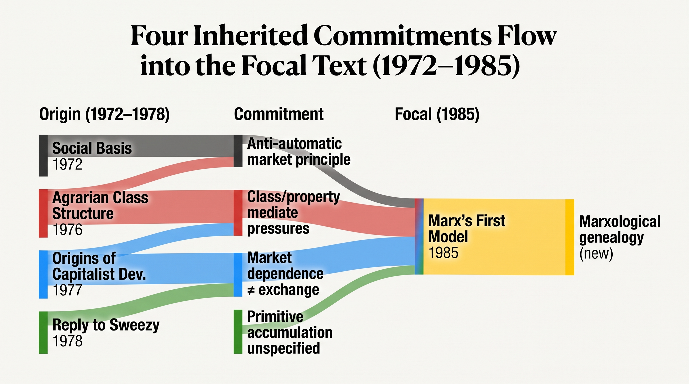
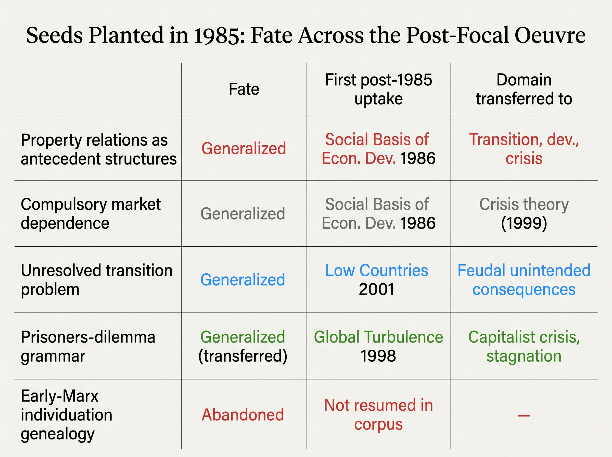

# Marx's First Model: A Hinge in Brenner's Oeuvre

*Where the 1985 focal text sits in a fifty-year intellectual trajectory — what it inherits, what it seeds, and what it leaves unresolved*

07 September 2026 · researcher edition · medium depth · job dossier-desks-run1d

## Summary

Marx's First Model of the Transition to Capitalism (1985) is neither the origin nor the culmination of Brenner's social-property-relations programme. It is a methodological hinge: it converts an already-established critique of trade-centred transition theory into an internal reconstruction of two incompatible Marxian historical materialisms, supplying a conceptual genealogy for commitments already explicit in 1976–78 while posing — but not solving — the positive mechanism of endogenous feudal transformation.
All four substantive causal commitments in the focal text — that commercial opportunities have socially variable effects, that class/property relations mediate demographic and commercial pressures, that capitalist compulsion derives from market dependence rather than exchange alone, and that transition requires specified class formation and primitive accumulation — appear verbatim in documents dated 1972–78. The focal text's only architecturally new element is the Marxological genealogy explaining why these commitments require rejecting one Marxism, not merely rival social theories.
The positive causal grammar the focal text introduces — property relations, compulsory reproduction, prisoners-dilemma aggregate outcomes — generalises across transition history, Soviet class analysis, and capitalist crisis theory in the post-1985 corpus, while the detailed Marxological apparatus of individuation, family atomism, and the craft–manufacture–machinofacture stage sequence does not recur as an explanatory object in the supplied later texts.

## 1. 1. The Road to 1985: What the Focal Text Inherits

Read backwards, the focal article is the most reflexive formulation of a class-relational agenda, not its founding statement. By 1972 Brenner had already argued that the reaction to commercial opportunity varies with the social, political, and economic character of the merchant group.[^1] By 1976, in Agrarian Class Structure, the claim was generalised: it is the structure of class relations, of class power, which will determine the manner and degree to which particular demographic and commercial changes will affect long-run trends.[^2] The Origins of Capitalist Development (1977) then stated the transition corollary directly — trade cannot determine the transformation of class relations of production.[^3] The 1978 Reply to Sweezy named the missing explanatory element: the conditions under which primitive accumulation could succeed in some places and fail in others were left entirely unspecified by trade-centred accounts.[^4]

What the focal text does with these inherited commitments is revisionary in form rather than substance. It recasts the anti-commercialisation thesis as a problem internal to Marx, arguing that early Marx's causal sequence assumes capitalist mechanisms in order to explain capitalism — it must, at every strategic juncture, assume the transition in order to explain the transition.[^5] Property relations are redefined not merely as class structures imposing developmental limits but as the relations of the direct producers to the means of production and to one another which allow for their continuing reproduction as they were.[^6] This shifts the inherited vocabulary from comparative outcomes to the conditions of reproduction that make any outcome possible.

The parallel political writings of 1980–84 — A New Social Democracy?, the Reagan articles, the Poland essay, and Can the Left Use the Democratic Party? — share the relational anti-automatism of the transition route. They insist that conditions do not produce political outcomes without organisation, strategy, and collective activity as mediators. The focal article does not cite these texts, and the relation is methodological rather than genealogical. But the shared premise — that no structural pressure carries determinate effects without a specified social mechanism — is the oeuvre's deepest continuity across independent argumentative routes.

**Table 1. Four substantive commitments inherited by the focal text and what it adds to each**

| Commitment | First established in (text, year) | Anchor in pre-focal text | What the focal text adds or changes | Finding |
|---|---|---|---|---|
| Commercial opportunities have socially variable effects; market causation is not automatic | The Social Basis of English Commercial Expansion (1972) | "The reaction to commercial opportunity (or cost), if indeed there is one, will tend to vary with the social, political, and economic character of the mercantile group." [^1] | Generalises the anti-automatic principle from merchant behaviour to modes of production: exchange cannot transform property relations unless market dependence already exists [^7] | F1, R1.F1 |
| Class/property relations mediate demographic and commercial pressures into divergent developmental outcomes | Agrarian Class Structure and Economic Development (1976) | "It is the structure of class relations, of class power, which will determine the manner and degree to which particular demographic and commercial changes will affect long-run trends in the distribution of income and economic growth — and not vice versa." [^2] | Recasts class/property relations as antecedent conditions of reproduction rather than effects of productive forces; supplies a general theoretical warrant for the 1976 finding [^8] | F2, R1.F2, R2.F1 |
| Capitalist compulsion derives from market dependence (separation from means of reproduction), not from exchange alone | The Origins of Capitalist Development (1977) | "Only where labour power is a commodity—and which was therefore called by Marx 'generalized commodity production'—is there the necessity of producing at the 'socially necessary' labour time in order to survive." [^9] | Uses the distinction diagnostically to expose the first Marxian model's circularity: its developmental mechanism works regularly only 'in an established capitalist economy,' presupposing what it must explain [^3] | F3, R1.F3, R2.F2 |
| Transition requires a specified account of class formation, class conflict, and primitive accumulation beyond the rise of trade | Reply to Sweezy (1978) | "Nor did Sweezy specify what conditions, other than the rise of the market, made it possible for the 'so-called primitive accumulation' to take place and succeed (in some places, while it failed in others)." [^4] | Defines the result of primitive accumulation precisely as the dissolution of pre-capitalist reproduction and compulsion to exchange; identifies endogenous transformation of property relations as the missing process [^10] | F4, R1.F4, R2.F3 |
| The focal text's genuine addition: a Marxological genealogy explaining why these commitments require rejecting one Marxism, not merely rival social theories | Focal text (1985) — no pre-1985 precedent for this argumentative form | "The place of relatively autonomous, 'discontinuous' processes of class development and class conflict was not made clear; or it appeared to be strictly subordinated to—the necessary effect of—the growth of trade." [^11] | Identifies an incompatible early Smithian model inside Marx itself; turns the anti-commercialization thesis into an internal reconstruction of two historical materialisms, explaining why the error recurs [^12] | F4, F27, R4.F1 |

*Each of the four positive causal commitments appears verbatim in a document dated 1972–78; the focal text's only architecturally new element is the internal Marxological genealogy that explains their necessity.*

*Figure 1. **Four Inherited Commitments Flow into the Focal Text (1972–1985).** All four substantive commitments of the focal text were established in – ; the focal text's only architecturally new element is the Marxological genealogy locating the Smithian error inside Marx.*

## 2. 2. The Focal Text's Distinctive Move: Marxological Reconstruction

The article's central claim is that there are two Marxian models of the transition from feudalism to capitalism — entirely incompatible, representing two fundamentally different historical materialisms.[^12] This is the oeuvre's only sustained internal reading of Marx's early corpus against his later one. The first model, laid out from the German Ideology through the Communist Manifesto, runs from productive forces through the division of labour to class and property, making class relations a passive reflex of technical development.[^13] Its mirror, Brenner argues, is Adam Smith: early Marx assumes that exposure to trade makes pre-capitalist producers act like embryonic capitalists.[^14]

The article explicitly qualifies its own procedure as based on hindsight — it employs conceptions of Marx's later works to interrogate his earlier works.[^15] That methodological asymmetry is the source of both the argument's power and its limits. The early texts establish the object criticised; the later-Marx materials, especially the Grundrisse and Pre-Capitalist Economic Formations, supply the critical standards. The positive alternative is deliberately left incomplete: the second model was never fully worked out by Marx, and the article declares itself Part I of a longer work to be published separately.[^16]

The first citations concentrated in the focal text — the German Ideology, the Poverty of Philosophy, the Communist Manifesto, Ronald Meek's Social Science and the Ignoble Savage, G. A. Cohen's Karl Marx's Theory of History, and Pre-Capitalist Economic Formations — form a Marxological cluster not assembled before or systematically repeated after in the supplied corpus. Conversely, the comparative agrarian historians (Postan, Hilton, Dobb) and the principal world-system target (Wallerstein) disappear from the focal article's citations, their absence marking a change of object from historical comparison to textual reconstruction rather than a theoretical abandonment.

The 1989 Bourgeois Revolution and Transition to Capitalism is the clearest direct sequel, restating both the incompatibility claim and the primitive-accumulation problem, then applying them to the English Civil War: it was the problem of accounting for the transformation of pre-capitalist property relations into capitalist property relations via the action of pre-capitalist society itself.[^17] Most later transition texts, however, presuppose rather than reargue the two-model distinction, and the detailed individuation genealogy — leading from tribal-communal property toward capitalism by way of exchange and specialization[^18] — does not recur as a major explanatory object.

## 3. 3. Seeds and Their Fates: What the Focal Text Generates

The focal article plants four seeds that the post-1985 corpus develops into a general causal grammar. First, the mode-of-production concept is immediately formalised by The Social Basis of Economic Development (1986) as a three-step sequence: form of property relations — rules for reproduction of the individual economic actors — long-term pattern of economic development/non-development.[^19] This converts the focal text's contrast between two Marxian ontologies into a positive analytical chain that later texts across transition history, comparative development, and crisis theory repeatedly invoke.

Second, the transition problem posed in the focal article — how feudal lords and peasants, in the very processes of attempting to reproduce themselves as feudal classes in a feudal manner, ended up bringing about the transformation[^20] — acquires a mechanism in The Low Countries in the Transition to Capitalism (2001): the emergence of capitalist social-property relations had to result from attempts by feudal individual actors to carry out feudal rules for reproduction.[^21] Property and Progress (2007) then systematises this into the explicit chain from historically specific, politically reproduced social property relations to individual rules for reproduction to aggregate developmental patterns to society-wide forms of crisis.[^22]

Third, the focal text's observation that pre-capitalist producers are not necessarily obliged to follow competitive innovations, since they do not produce for exchange and so do not have to compete on the market to survive,[^23] is developed in England's Divergence from China's Yangzi Delta (2002) into a comparative explanation of why English producers — free and compelled by competition to allocate their resources so as to maximize their rate of return[^24] — diverged from Yangzi delta peasants who followed a subsistence logic.

Fourth, the focal text introduces the prisoners-dilemma grammar that will define Brenner's crisis theory: in providing reasons to forsake the invisible hand, Marx obliges himself to confront a whole series of prisoners dilemmas.[^25] The Economics of Global Turbulence (1998/2006) transposes this to established capitalism — the economy enters the downturn because the measures that individual economic actors are obliged to take to counteract their own reduced profitability serve to reproduce the problem of reduced profitability at the aggregate level[^26] — and the 2025 Long Downturn essay retains this grammar as the core of its secular stagnation account.

What does not travel is the focal text's detailed Marxological scaffolding. The craft–manufacture–machinofacture stage sequence, the family as the ultimate social atom of early Marx's mechanical individualism, and the extended individuation genealogy appear in the focal article but not as recurring explanatory objects in the post-1985 corpus. Later transition syntheses retain the critique of productive-force determinism but move directly to property relations, class conflict, and historical cases rather than rebuilding the textual genealogy.

**Table 2. Seeds planted by the focal text, their first later development, and their fate across the oeuvre**

| Seed / element | Focal anchor | First developed in (post-1985) | How developed | Fate: generalized / selective / abandoned |
|---|---|---|---|---|
| Property relations as antecedent structures of societal reproduction | "Its master principle is the mode of production, conceived as a system of social Property relations which make possible, and thereby structure, Societal reproduction" [^8] | The Social Basis of Economic Development (1986), then Property and Progress (2007) | 1986 converts the focal contrast into a formal sequence: property relations → rules for reproduction → long-term developmental patterns; 2007 systematizes the full causal chain across transition, comparative development, and crisis [^22] | Generalized |
| Compulsory market dependence as the distinguishing mark of capitalism (not exchange alone) | "everyone must buy most of what they need. In order to buy what they need, they must not only have something they} can sell, but actually be able to sell it \"on the market\"" [^27] | The Social Basis of Economic Development (1986); extended to crisis theory by Competition and Class (1999) | 1986 formalizes the compulsion: 'they specialize because they must exchange'; crisis theory extends the same compulsion to explain why cost-cutting under competition is structurally unavoidable for capitalist enterprises [^28] | Generalized |
| The unresolved transition problem: how feudal actors pursuing feudal reproduction unintentionally transform feudal property relations | "To confront this problel - which Marx barely posed and never solved - will require in my opinion, a deepened appreciation of the role of clas: formation and class struggle" [^29] | The Low Countries in the Transition to Capitalism (2001) | Answers the focal open question historically: capitalist social-property relations had to result from feudal actors carrying out feudal rules for reproduction; the unintended-consequences formula becomes a positive historical proposition [^21] | Generalized |
| Prisoners-dilemma grammar: individually necessary reproductive action produces collectively self-undermining aggregate outcomes | "In providing reasons to foresake the invisible hand, Marx obliges himself to confront a whole series of prisoners dilemmas." [^25] | The Economics of Global Turbulence (1998) | Transfers the grammar from the transition problem to capitalist crisis: firms' individually compelled remedies for reduced profitability reproduce reduced profitability at the aggregate level; the 2025 text restates the same paradox for secular stagnation [^30] | Generalized (transferred domain) |
| Early-Marx individuation genealogy, family atomism, and craft–manufacture–machinofacture stage sequence | "In broadest terms, then, Marx sketches a process of individuation leading from tribal-communal property toward capitalism by way of exchange and specialization." [^18] | Not returned to as a major explanatory object in any supplied later text | 1989 resumes the two-model framework but shifts to English historical interpretation; later texts retain the critique of productive-force primacy without rebuilding the detailed genealogy of individuation or the stage sequence [^31] | Abandoned (within supplied corpus) |

*The positive causal grammar — property relations → reproductive rules → aggregate outcomes with unintended consequences — generalizes across transition, Soviet, and crisis contexts, while the focal text's detailed Marxological apparatus (individuation, family atomism, stage sequence) does not recur as an explanatory object.*

*Figure 2. **Seeds Planted in 1985: Fate Across the Post-Focal Oeuvre.** The focal text's positive causal grammar — property relations, compulsory reproduction, prisoners-dilemma aggregate outcomes — generalizes across domains, while its detailed Marxological apparatus of individuation and stage sequence is abandoned within the supplied corpus.*

## 4. 4. Continuity, Change, and the Rupture Question

Tested against the rupture criterion, the focal text is a deepening with a temporary Marxological reorientation, not an epistemic break. The object and causal ontology — class/property relations as mediating structures antecedent to production — are continuous across 1972–2025. What changes at 1985 is the evidentiary route (comparative history and theoretical controversy give way to internal reconstruction of two Marxisms) and the interlocutors (Postan, Hilton, Wallerstein, and Dobb are temporarily displaced by the German Ideology, Pre-Capitalist Economic Formations, and Meek). The same-year Agrarian Roots already contains mature social-property analysis — social-property systems, once established, tend to set strict limits and impose certain overall patterns upon the course of economic evolution[^32] — which confirms that 1985 marks self-clarification, not inauguration.

Two genuine changes are located elsewhere in the oeuvre. The shift in immediate causal priority from class struggle to inter-capitalist competition as the driver of crisis rhythms occurs at 1998, not 1985: it is the logic of competition, not class struggle, that rules the deeper rhythms of growth or recession.[^30] This creates a real tension with the focal article's closing demand for a deepened appreciation of the role of class formation and class struggle in shaping social development and societal transformation,[^33] though the collection reconciles the two by assigning competition immediate priority within established capitalism and class conflict constitutive priority in forming or transforming property relations. The second reorientation — political capitalism — is still later, emerging with Seven Theses on American Politics (2022) and reaching its fullest statement in the 2025 Long Downturn essay, which identifies a new circuit of capital whereby a surplus is realized through the investment of money in assets — M–A–M′ — alongside rather than replacing productive accumulation.[^34]

The most useful period division is therefore formation (1972–84) versus codification, extension, and late reorientation (1985–2025), with the focal boundary marking theoretical self-consciousness rather than substantive novelty. Researchers who treat the focal article as foundational risk misreading an act of retrospective systematisation as prospective discovery.

**Table 3. Dimensions of potential change across the focal boundary, classified by type**

| Dimension | Before 1985 | At or after focal text | Type of change | Rupture evidence? |
|---|---|---|---|---|
| Immediate method / evidentiary route | Comparative agrarian history and external polemic against Wallerstein, Sweezy, and demographic models [^35] | Internal Marxological reconstruction of two incompatible historical materialisms; historical comparison resumes from 1986 onward [^12] | Methodological — consistent with deepening | No: a change in evidentiary route does not alter the causal ontology |
| Principal interlocutors | Wallerstein, Sweezy, Dobb, Postan, Hilton, Pirenne — external rival theories and empirical historians [^3] | Early Marx (German Ideology, Poverty of Philosophy, Manifesto) and Adam Smith as genealogical source; Wallerstein and Sweezy repositioned as later adopters of an early-Marxian Smithian strategy [^36] | Change in interlocutors — consistent with deepening | No: the same causal objection (trade cannot transform property relations) is now located inside Marx rather than only against rival theorists |
| Causal ontology: property relations as antecedent, mediating structures | "Different class structures, specifically 'property relations' or 'surplus extraction relations', once established, tend to impose rather strict limits and possibilities, indeed rather specific long-term patterns, on a society's economic development." [^37] | "social-property systems, once established, tend to set strict limits and impose certain overall patterns upon the course of economic evolution." [^32] | Vocabulary sharpening (class structure → social-property relations structuring reproduction) — continuous in substance | No: the causal claim is identical on both sides of 1985; the reformulation is terminological and organizational, not ontological |
| Causal ontology: market dependence not exchange as capitalist compulsion | "Only where labour power is a commodity—and which was therefore called by Marx 'generalized commodity production'—is there the necessity of producing at the 'socially necessary' labour time in order to survive." [^9] | "My point of departure is the anarchy of capitalist production and, in particular, the competitive pressure on capitalist enterprises to cut costs as the condition for their very survival." [^38] | Continuous — consistent with deepening | No: market dependence as the basis of compulsory competition persists without interruption before and after 1985 |
| Crisis mechanism: class struggle vs. inter-capitalist competition as immediate causal driver | "It is these contrasting outcomes of processes of class conflict—dependent in turn on contrasting evolutions of class society and disparate balances of class forces at different points in time—which are at the heart of the original transition from feudalism to capitalism." [^39] | "It is the logic of competition, not class struggle, that rules the deeper rhythms of growth or recession." [^30] | Real later tension — but located at 1998, not at 1985 | No rupture at 1985: this shift emerges in the 1998 crisis synthesis more than a decade after the focal text; it does not originate at the focal boundary |
| Political capitalism: asset-based circuit alongside productive accumulation | Focal text centers capitalist compulsion on competitive productive reproduction: "To insure continued ability to produce for exchange and to compete, everyone has a motivation to adopt the most advanced technique." [^40] | "No longer does the classical capitalist circuit of capital M–C–M' prevail nearly universally... There has emerged alongside it a new circuit of capital whereby a surplus is realized through the investment of money in assets—viz. M–A–M'." [^34] | Later reorientation — located at 2022–25, not at 1985 | No rupture at 1985: political capitalism is a late conceptual addition that does not originate at the focal text; the 2025 text presents it as emerging alongside, not replacing, productive capitalism |

*Changes in method and interlocutors cluster at 1985, while changes in causal ontology are either absent or located at later dates (1998 for competition-over-class-struggle; 2022–25 for political capitalism).*

## 5. 5. Open Questions and Methodological Limits

Three clusters of open questions arise from the analysis. The first is textual-bibliographic. The focal article's announced continuation was never identified in the supplied corpus. If Part II was published under another title, or quietly abandoned, the answer would decide whether the two-model Marxological project became a sustained programme or remained a specialised first instalment whose positive framework migrated elsewhere. Locating that continuation is the single highest-priority research action for scholars of the focal text.

The second cluster concerns the focal text's sharp binary. The article acknowledges a passage where early Marx recognises that only generalised world-market competition assures the permanence of productive forces — a moment of self-awareness Marx allegedly failed to act on. That concession leaves the early/late border somewhat porous. A fuller reading of the Grundrisse and Capital in context, rather than through the retrospective hindsight the article itself endorses, might yield a more differentiated picture of Marx's development than either the early Smithian or the later property-relations label allows.

The third cluster is the tension between the focal demand for class formation and class struggle at the centre of transition theory and the post-1998 crisis account where competition among capitals is the immediate mechanism. The collection's reconciliation — competition operates within established capitalism, class conflict is constitutive at the level of property transformation — is coherent but remains a scholarly reconstruction. Brenner does not state it as a formal division of explanatory labour. Whether the two registers can be integrated into a single framework, or whether they reflect distinct levels of analysis that resist full unification, is the deepest open question the supplied corpus raises.

Finally, the sample itself imposes limits. Twelve works listed in the oeuvre are not supplied, including Dobb on the Transition, The Rises and Declines of Serfdom, and Property Relations and the Growth of Agricultural Productivity. Any claim about the first or last appearance of a theme, or about the disappearance of a concept, applies strictly to the supplied fifty-eight texts. The composition histories of the focal article, the same-year Agrarian Roots, and the 1986 Social Basis remain unknown; without draft dates or correspondence, the question of whether the focal text generated the rules-for-reproduction formulation or was composed alongside it cannot be resolved from publication dates alone.

## 6. What this means

The 1985 focal text is best described as a methodological hinge: retrospectively, it culminates the 1972–78 anti-commercialisation agenda by converting its empirical and polemical conclusions into an internal Marxological genealogy; prospectively, it is a way station, posing the positive transition mechanism — how feudal reproduction unintentionally generates capitalist property relations — that later texts from The Low Countries (2001) to Property and Progress (2007) supply.
For researchers, the practical implication is a specific reading sequence: Origins of Capitalist Development (1977) first, to confirm that the focal text's substantive commitments predate it; Agrarian Class Structure (1976) second, for the comparative empirical foundation; Bourgeois Revolution and Transition to Capitalism (1989) third, as the clearest direct uptake; The Low Countries (2001) fourth, for the unintended-consequences mechanism the focal text leaves open; and Property and Progress (2007) fifth, for the mature four-level causal chain. The focal article is indispensable for understanding why Brenner frames his claims as a rejection of one Marxism rather than of rival social theories — but it should not be read as the source of the substantive position it explains.
Two questions require empirical resolution before the account can be closed: whether the announced Part II was published under another title, and whether the 2022–25 political-capitalism concept represents a durable new configuration or a conjunctural elaboration of the long-downturn thesis. Both questions are open in the supplied corpus and cannot be settled by interpretive inference alone.

## Anchors

[^1]: (1972) —  (1972) — The Social Basis of English Commercial Expansion, 1550–1650 [profile]: “The reaction to commercial opportunity (or cost), if indeed there is one, will tend to vary with the social, political, and economic character of the mercantile group.”
[^2]: (1976) —  (1976) — Agrarian Class Structure and Economic Development in Pre-Industrial Europe [profile]: “It is the structure of class relations, of class power, which will determine the manner and degree to which particular demographic and commercial changes will affect long-run trends in the distributio”
[^3]: (1977) —  (1977) — The Origins of Capitalist Development: A Critique of Neo-Smithian Marxism [profile]: “The rise of trade is not at the origin of a dynamic of development because trade cannot determine the transformation of class relations of production.”
[^4]: (1978) —  (1978) — Reply to Sweezy [profile]: “Nor did Sweezy specify what conditions, other than the rise of the market, made it possible for the 'so-called primitive accumulation' to take place and succeed (in some places, while it failed in oth”
[^5]: (1985) —  (1985) — Marx's First Model of the Transition to Capitalism: “It must, at every strategic juncture, assume the transition in order to explain the transition.”
[^6]: (1985) —  (1985) — Marx's First Model of the Transition to Capitalism: “In the Grundrisse, Marx defines property relations as the relations of the direct producers to the means of production and to one another which allow for their continuing reproduction as they were.”
[^7]: (1985) —  (1985) — Marx's First Model of the Transition to Capitalism: “property relations form the precondition and basis for production, they are not the product of production.”
[^8]: (1985) —  (1985) — Marx's First Model of the Transition to Capitalism: “Its master principle is the mode of production, conceived as a system of social Property relations which make possible, and thereby structure, Societal reproduction”
[^9]: (1977) —  (1977) — The Origins of Capitalist Development: A Critique of Neo-Smithian Marxism [profile]: “Only where labour power is a commodity—and which was therefore called by Marx 'generalized commodity production'—is there the necessity of producing at the 'socially necessary' labour time in order to”
[^10]: (1985) —  (1985) — Marx's First Model of the Transition to Capitalism: “Yet, Marx also says that the condition for the rise of capitalism is precisely the dissolution of these pre-capitalist property forms”
[^11]: (1978) —  (1978) — Reply to Sweezy [profile]: “The place of relatively autonomous, 'discontinuous' processes of class development and class conflict was not made clear; or it appeared to be strictly subordinated to—the necessary effect of—the grow”
[^12]: (1985) —  (1985) — Marx's First Model of the Transition to Capitalism: “There are two Marxian models of the transition from feudalism to capitalism. These are often confused and run_ together. Nevertheless, they are entirely incompatible: they represent two fundamentally”
[^13]: (1985) —  (1985) — Marx's First Model of the Transition to Capitalism: “The central explanatory notion at the core of this model is the self-developing division of labor.”
[^14]: (1985) —  (1985) — Marx's First Model of the Transition to Capitalism: “Marx ends up assuming that that exposure to”
[^15]: (1985) —  (1985) — Marx's First Model of the Transition to Capitalism: “This section is, frankly, based on "hindsight". That is, — it employs conceptions of Marx's later works to interrogate”
[^16]: (1985) —  (1985) — Marx's First Model of the Transition to Capitalism: “This article is Part I of a longer work to be published separately.”
[^17]: (1989) —  (1989) — Bourgeois revolution and transition to capitalism [profile]: “It was the problem of accounting for the transformation of pre-capitalist property relations into capitalist property relations via the action of pre-capitalist society itself.”
[^18]: (1985) —  (1985) — Marx's First Model of the Transition to Capitalism: “In broadest terms, then, Marx sketches a process of individuation leading from tribal-communal property toward capitalism by way of exchange and specialization.”
[^19]: (1986) —  (1986) — The social basis of economic development [profile]: “form of property relations—rules for reproduction of the individual economic actors>long-term pattern of economic development/non-development.”
[^20]: (1985) —  (1985) — Marx's First Model of the Transition to Capitalism: “how feudal lords peasants, in the very processes of attempting to reproduce themselves as feudal classes in a feudal manner, ended @ bringing about the transformation”
[^21]: (2001) —  (2001) — The Low Countries in the Transition to Capitalism [profile]: “the emergence of capitalist social-property relations had to result from attempts by feudal individual actors to carry out feudal rules for reproduction”
[^22]: (2007) —  (2007) — Property and Progress: Where Adam Smith Went Wrong [profile]: “The causal chain runs from historically specific, politically reproduced social property relations to individual rules for reproduction to aggregate developmental patterns to society-wide forms of cri”
[^23]: (1985) —  (1985) — Marx's First Model of the Transition to Capitalism: “they are not necessarily obliged to follow, since they do not produce for exchange and so do not have to compete on the market to survive.”
[^24]: (2002) —  (2002) — England's Divergence from China's Yangzi Delta: Property Relations, Microeconomics, and Patterns of Development [profile]: “They were therefore free and compelled by competition to allocate their resources so as to maximize their rate of return (the gains from trade).”
[^25]: (1985) —  (1985) — Marx's First Model of the Transition to Capitalism: “In providing reasons to foresake the invisible hand, Marx obliges himself to confront a whole series of prisoners dilemmas.”
[^26]: (2006) —  (2006) — The Economics of Global Turbulence: The Advanced Capitalist Economies from Long Boom to Long Downturn, 1945-2005 [profile]: “The economy enters the downturn, then, because the measures that individual economic actors are obliged to take to counteract their own reduced profitability serve to reproduce the problem of reduced”
[^27]: (1985) —  (1985) — Marx's First Model of the Transition to Capitalism: “everyone must buy most of what they need. In order to buy what they need, they must not only have something”
[^28]: (1986) —  (1986) — The social basis of economic development [profile]: “It is not that people exchange so as to specialize, or specialize so as to exchange; they specialize because they must exchange.”
[^29]: (1985) —  (1985) — Marx's First Model of the Transition to Capitalism: “To confront this problel - which Marx barely posed and never solved - will require in my opinion, a deepened appreciation of the role of clas: formation and class struggle”
[^30]: (1998) —  (1998) — The Economics of Global Turbulence (Special Issue) [profile]: “It is the logic of competition, not class struggle, that rules the deeper rhythms of growth or recession.”
[^31]: (1985) —  (1985) — Marx's First Model of the Transition to Capitalism: “A premise of all social-historical development, it is the ultimate social atom.”
[^32]: (1985) —  (1985) — The Agrarian Roots of European Capitalism [profile]: “social-property systems, once established, tend to set strict limits and impose certain overall patterns upon the course of economic evolution.”
[^33]: (1985) —  (1985) — Marx's First Model of the Transition to Capitalism: “To confront this problel - which Marx barely posed and never solved - will require in my opinion, a deepened appreciation of the role of clas: formation and class struggle in shaping social develop an”
[^34]: (2025) —  (2025) — The Long Downturn and Its Political Results: A Reply to Critics [profile]: “No longer does the classical capitalist circuit of capital M–C–M' prevail nearly universally... There has emerged alongside it a new circuit of capital whereby a surplus is realized through the invest”
[^35]: (1976) —  (1976) — Agrarian Class Structure and Economic Development in Pre-Industrial Europe [profile]: “The breakthrough from "traditional economy" to relatively self-sustaining economic development was predicated upon the emergence of a specific set of class relations in the countryside, that is capita”
[^36]: (1985) —  (1985) — Marx's First Model of the Transition to Capitalism: “any number of Marxists, from Engels to Sweezy to Wallerstein, would "follow" the master in adopting essentially Smithian strategies to explain large-scale historical transformations”
[^37]: (1976) —  (1976) — Agrarian Class Structure and Economic Development in Pre-Industrial Europe [profile]: “Different class structures, specifically "property relations" or "surplus extraction relations", once established, tend to impose rather strict limits and possibilities, indeed rather specific long-te”
[^38]: (1999) —  (1999) — Competition and Class: A Reply to Foster and McNally [profile]: “My point of departure is the anarchy of capitalist production and, in particular, the competitive pressure on capitalist enterprises to cut costs as the condition for their very survival.”
[^39]: (1977) —  (1977) — The Origins of Capitalist Development: A Critique of Neo-Smithian Marxism [profile]: “It is these contrasting outcomes of processes of class conflict—dependent in turn on contrasting evolutions of class society and disparate balances of class forces at different points in time—which ar”
[^40]: (1985) —  (1985) — Marx's First Model of the Transition to Capitalism: “To insure continued ability to produce for”

## How this was made

- [focal:em:CBT7B8CL] (1985) —  (1985) — Marx's First Model of the Transition to Capitalism
- [before:em:VAYFENVQ] (1972) —  (1972) — The Social Basis of English Commercial Expansion, 1550–1650 [profile]
- [before:em:27CQX9UR] (1976) —  (1976) — Agrarian Class Structure and Economic Development in Pre-Industrial Europe [profile]
- [before:em:HZHLWZ2R] (1977) —  (1977) — The Origins of Capitalist Development: A Critique of Neo-Smithian Marxism [profile]
- [before:em:9VI9FSBK] (1978) —  (1978) — Reply to Sweezy [profile]
- [before:em:BHRWPT7F] (1980) —  (1980) — A New Social Democracy? [profile]
- [before:em:TGWH6ZPU] (1981) —  (1981) — Reagan, the Right and the Working Class [profile]
- [before:em:6U35NCDN] (1981) —  (1981) — The Right Wing and the Working Class: A Response [profile]
- [before:em:Q6WXW5PM] (1983) —  (1983) — Again on Reform or Revolution in Poland, a response to Theoretical Review [profile]
- [before:em:SS9844LV] (1984) —  (1984) — Can the Left Use the Democratic Party? [profile]
- [after:em:9RJCZ6KQ] (1985) —  (1985) — The Agrarian Roots of European Capitalism [profile]
- [after:em:HYA4MA32] (1985) —  (1985) — The Paradox of Social Democracy: The American Case [profile]
- [after:em:3JSL5XP4] (1986) —  (1986) — Austerity & Interventionism: Political Effects of Economic Decline (Part 2) [profile]
- [after:em:S52G8SSP] (1986) —  (1986) — The Deep Roots of U.S. Economic Decline [profile]
- [after:em:KUF7CP3S] (1986) —  (1986) — The Elections and the Left [profile]
- [after:em:XTTG43Z5] (1986) —  (1986) — The social basis of economic development [profile]
- [after:em:3PBW7WA9] (1988) —  (1988) — Notes on the Crash and Crisis [profile]
- [after:em:LJFTS6KY] (1989) —  (1989) — Bourgeois revolution and transition to capitalism [profile]
- [after:em:2VPKTHSN] (1989) —  (1989) — Untitled contribution on the class nature of the Soviet Union [profile]
- [after:em:IMRP3JQ7] (1991) —  (1991) — Soviet Union-Eastern Europe, Part II: Nature of the Transition [profile]
- [after:em:D28G2RWK] (1991) —  (1991) — The Regulation Approach: Theory and History [profile]
- [after:em:GR426WC5] (1991) —  (1991) — The Soviet Union & Eastern Europe, Part I [profile]
- [after:em:K67KNHJC] (1991) —  (1991) — Why is the United States at War with Iraq? [profile]
- [after:em:8X5QYXZG] (1993) —  (1993) — Failing to Bring the State Back In [profile]
- [after:em:ZH86SA7Z] (1993) —  (1993) — Merchants and Revolution: Commercial Change, Political Conflict, and London's Overseas Traders, 1550–1653 [profile]
- [after:em:ZJHK954P] (1993) —  (1993) — The Problem of Reformism [profile]
- [after:em:U42IYG2I] (1995) —  (1995) — Clinton's Failure & the Politics of U.S. Decline [profile]
- [after:em:BD8RCVGB] (1998) —  (1998) — A View of the Teamster Tragedy [profile]
- [after:em:ZFPK9NTQ] (1998) —  (1998) — The Economics of Global Turbulence (Special Issue) [profile]
- [after:em:L7CX4T2I] (1998) —  (1998) — The Looming Crisis of World Capitalism [profile]
- [after:em:4DYCDX3A] (1999) —  (1999) — Competition and Class: A Reply to Foster and McNally [profile]
- [after:em:A5KQX6MT] (1999) —  (1999) — Reply to Critics [profile]
- [after:em:T33SBUEY] (2000) —  (2000) — The Boom and the Bubble [profile]
- [after:em:ATQRKQMC] (2001) —  (2001) — The Low Countries in the Transition to Capitalism [profile]
- [after:em:TAGBBUU9] (2001) —  (2001) — The world economy at the turn of the millennium toward boom or crisis? [profile]
- [after:em:F4ET2EQE] (2002) —  (2002) — An Economy of Two, Three Many Enrons [profile]
- [after:em:KFEA7SRZ] (2002) —  (2002) — Competition and profitability: a reply to Ajit Zacharias [profile]
- [after:em:UYYQABRK] (2002) —  (2002) — England's Divergence from China's Yangzi Delta: Property Relations, Microeconomics, and Patterns of Development [profile]
- [after:em:TJJZHZ6J] (2002) —  (2002) — The Boom, the Bubble, and the Future [profile]
- [after:em:TP2BBTZI] (2002) —  (2002) — The Economy After the Boom [profile]
- [after:em:CB8B4RIL] (2002) —  (2002) — The trajectory of the manufacturing profit rate: a reply to Duménil and Lévy [profile]
- [after:em:FDEWCETE] (2004) —  (2004) — Elections & the Democrats [profile]
- [after:em:DXBHHXIJ] (2004) —  (2004) — New Boom or New Bubble? The Trajectory of the US Economy [profile]
- [after:em:BHSWIJKN] (2005) —  (2005) — The Capitalist Economy, 1945–2000: A Reply to Konings and to Panitch and Gindin [profile]
- [after:em:QP74AWIU] (2006) —  (2006) — The Economics of Global Turbulence: The Advanced Capitalist Economies from Long Boom to Long Downturn, 1945-2005 [profile]
- [after:em:PWVE5QPN] (2006) —  (2006) — The origins of capitalism [profile]
- [after:em:BJ4R4EPJ] (2006) —  (2006) — What Is, and What Is Not, Imperialism? [profile]
- [after:em:C3E3GHEL] (2007) —  (2007) — Property and Progress: Where Adam Smith Went Wrong [profile]
- [after:em:UFFBTFJW] (2007) —  (2007) — Structure vs Conjuncture: The 2006 Elections and the Rightward Shift [profile]
- [after:em:32EZD9WF] (2009) —  (2009) — What Is Good for Goldman Sachs Is Good for America: The Origins of the Current Crisis [profile]
- [after:em:WNQLQHP7] (2010) —  (2010) — The Political Economy of the Rank-and-File Rebellion [profile]
- [after:em:S8AUYJ5G] (2011) —  (2011) — Feudalism [profile]
- [after:em:C8KU3XVS] (2011) —  (2011) — The Pre-history of Core–Periphery [profile]
- [after:em:7QSF5QUB] (2017) —  (2017) — Introducing Catalyst [profile]
- [after:em:NE7AJREG] (2020) —  (2020) — Escalating Plunder [profile]
- [after:em:2887CIMF] (2021) —  (2021) — From theory to history: 'The European Dynamic' or feudalism to capitalism? [profile]
- [after:em:V68V5D49] (2022) —  (2022) — Seven Theses on American Politics [profile]
- [after:em:VE9TU4JA] (2025) —  (2025) — The Long Downturn and Its Political Results: A Reply to Critics [profile]

| # | Step | What happened | Calls | Tokens in / out | Cost | Time |
|---|---|---|---|---|---|---|
| 1 | reconnaissance | Read every document; profiled each (thesis, method, anchored claims) and mapped the corpus. | 50 | 251,808 / 80,125 | $1.96 | 0s |
| 2 | brief | Proposed three angles with engines, cost and shape; one was chosen. | 0 | — | — | 0s |
| 3 | plan | Turned the angle into an ordered engine sequence for the executor (depth policy enforced). | 0 | — | — | 2s |
| 4 | analysis | Ran the engines through the executor; each phase read the previous phases' prose. | 8 | 1,392,364 / 62,937 | $3.41 | 977s |
| 5 | spine | Decided what the dossier argues: one claim per section, and the table or diagram each claim needs. | 2 | 269,326 / 9,312 | $1.15 | 223s |
| 6 | tables | Built the tables the spine commissioned; every row verified against verbatim anchors. | 1 | 134,601 / 5,747 | $0.59 | 119s |
| 7 | figures | Drew the diagrams the spine commissioned (primitive → format → labels), rendered and checked each against its spec. | 10 | 64,225 / 6,176 | $0.84 | 163s |
| 8 | compose | Wrote the sections with the exhibits on the desk, placing each at its pointer; then the summary and the close against the body; rendered HTML, PDF and Markdown. | 3 | 242,257 / 15,018 | $1.05 | 157s |
| 9 | crosscheck | Read the dossier as one thing and recorded every finding with its cure; acted on the safe ones. | 1 | 14,074 / 881 | $0.06 | 40s |
| 10 | receipts | Totalled every model and image call. | 0 | — | — | 1s |

| Phase | Engine | Depth | Passes | Model | Why |
|---|---|---|---|---|---|
| 4.1 | The author's agendas and turns | surface | 1 | openrouter/openai/gpt-5.6-sol | from the chosen deliverable's path |
| 4.2 | What the focal text cites, against the rest | surface | 2 | openrouter/openai/gpt-5.6-sol | from the chosen deliverable's path |
| 4.3 | The focal text as the culmination of what came before | surface | 2 | openrouter/openai/gpt-5.6-sol | from the chosen deliverable's path |
| 4.4 | The focal text as step one of a journey | surface | 1 | openrouter/openai/gpt-5.6-sol | from the chosen deliverable's path |
| 4.5 | Epistemic rupture detector | surface | 1 | openrouter/openai/gpt-5.6-sol | from the chosen deliverable's path |
| 4.6 | The paper's place in the oeuvre: the memo | surface | 1 | openrouter/openai/gpt-5.6-sol | from the chosen deliverable's path |

*Strategy.* the path was fixed on the request; no planner call (fast lane)

| Figure | Primitive | Format | Style | Attempts | Check |
|---|---|---|---|---|---|
| Four Inherited Commitments Flow into the Focal Text (1972–1985) | temporal_evolution | alluvial_diagram | explanatory_narrative | 1 | passed: format ok, 10/10 labels |
| Seeds Planted in 1985: Fate Across the Post-Focal Oeuvre | comparative_positioning | matrix | explanatory_narrative | 4 | passed: format ok, 20/20 labels |

| Finding | Where | Cure | Fate |
|---|---|---|---|
| caption carries number (clamp) | figure_key inherited_commitments_cascade | rewrite caption | executed |
| figure depicts other (clamp) | figure_key seeds_fates_matrix | rerender figure | resolved |

**Totals:** 71 model calls, 2,368,655 input tokens, 180,196 output tokens, $9.06, 28.0 min.
Walls: 16 table rows kept, 0 dropped for unverifiable anchors
